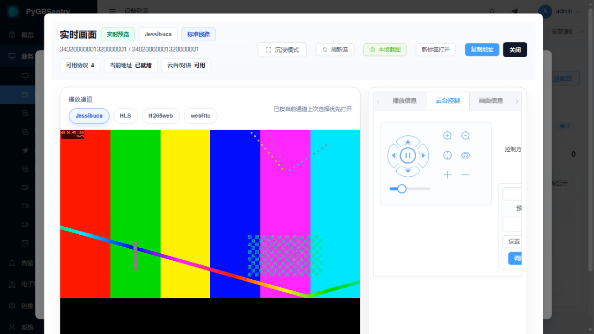
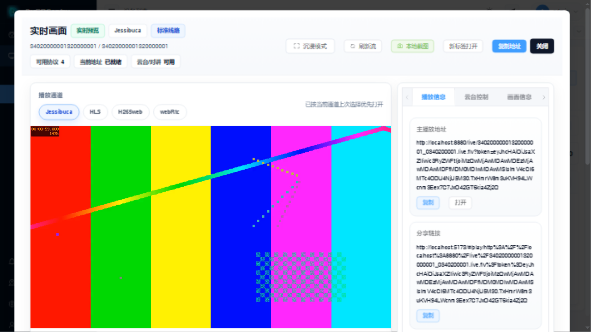

<div align="center">

  

# PyGBSentry

_开箱即用的国标（GB/T 28181-2022）视频管理平台 —— 纯 Python 自研 SIP 栈_

<p align="center">
  <strong>🇨🇳 中文</strong> ｜ <a href="README_EN.md">🇬🇧 English</a>
</p>

<p align="center">
  
  
  
  
  
  
</p>

<p align="center">
  <a href="https://github.com/suoten/PyGBSentry/stargazers"></a>
  <a href="https://gitee.com/suoten/PyGBSentry/stargazers"></a>
  <a href="https://github.com/suoten/PyGBSentry/issues"></a>
</p>

**[GitHub](https://github.com/suoten/PyGBSentry)** ｜ **[Gitee](https://gitee.com/suoten/PyGBSentry)**

</div>

---

> **🚀 想要一个秒级启动、纯 Python 原生、对 AI 生态友好的国标视频平台？**
> 就是它了。

**PyGBSentry** 基于**最新 GB/T 28181-2022 标准**构建（向下兼容 2016 版设备）。与依赖第三方 C 库或商业 SIP 中间件的方案不同，我们从零实现了**纯 Python 的 SIP/GB28181 协议栈**，让你真正掌控从信令到流媒体的全链路。

---

## ✨ 为什么选择 PyGBSentry？

| 维度 | PyGBSentry | 传统方案 |
|------|-----------|---------|
| ⚡ 启动速度 | **秒级** | 分钟级 |
| 🛠️ 开发效率 | **Python 生态** | 复杂配置 |
| 🤖 AI 集成 | **原生友好** | 需要额外适配 |
| 🔄 并发模型 | **异步架构** | 线程模型 |

Python + FastAPI 意味着**秒级启动**、**原生异步并发**和**开箱即用的 AI 生态**。不用和 XML 缠斗，没有不透明的二进制——只有干净、可读的 Python。

---

## 🎯 核心特性

### ⚡ 首帧 < 500ms

RTP 端口池预分配 + 四路并行 INVITE + RTT 自适应定时器，交付你在 GB28181 平台上见过的最快实况连接。

### 🩺 六维健康评分 + 播放自愈

六大维度实时健康评分，智能播放恢复：

- **RTCP NACK** —— 丢包瞬时重传
- **UDP → TCP 自动降级** —— 网络劣化时无缝切换传输协议
- **双缓冲无缝切换** —— 零花屏的流切换

### 🔍 纯 Python SIP 栈 —— 没有黑盒

每一条 SIP 消息都用纯 Python 解析、构造与分发。完全透明、完全可调试、完全属于你。在信令流程的任意位置打下断点，看清正在发生的一切。

### 📡 GB/T 28181-2022 原生支持

全面符合最新国标：

- `a=track` SDP 协商
- 绝对云台定位
- 3D 拉框放大（DragZoom）
- 设备文件目录检索

### 🧩 插件生态

无需 Fork 即可扩展：

- **飞书** —— 告警通知
- **企业微信** —— 企业消息
- **MQTT** —— 物联网桥接
- **S3** —— 云端归档
- **AI** —— 推理管线集成

### 🏎️ 高并发优化

| 优化项 | 效果 |
|-------|------|
| 分片 DialogManager | 会话分片，锁竞争降低 16 倍 |
| 对象池 | 2K+ 对象预分配，热路径零 GC 压力 |
| 线程池 | SIP 消息多核并行解析 |
| 预过滤 Handler | 分发前减少 70% 无效消息扫描 |

### 🏗️ 生产级高可用

- **RFC 3261 状态机** —— 标准兼容的 SIP 会话生命周期
- **Redis 持久化** —— 会话状态重启不丢
- **节点故障转移** —— 多节点部署自动恢复
- **TLS 热重载** —— 证书轮换不停机

---

## 📸 界面预览

<table>
  <tr>
    <td align="center"><b>实时预览（多内核 + 云台控制）</b></td>
  </tr>
  <tr>
    <td></td>
  </tr>
  <tr>
    <td align="center"><b>设备列表</b></td>
  </tr>
  <tr>
    <td></td>
  </tr>
</table>

> 更多界面截图见 [docs/images/](docs/images/)。

---

## 🏛️ 技术架构

```
┌─────────────────────────────────────────────────────────────────────┐
│                        终端层（多端覆盖）                              │
│   ┌──────────────┐  ┌──────────────┐  ┌──────────────────────────┐  │
│   │   Web 后台    │  │  Mobile App  │  │    第三方平台 / 设备      │  │
│   │  Vue 3 + TS  │  │  uni-app     │  │    GB28181 级联对接       │  │
│   └──────┬───────┘  └──────┬───────┘  └────────────┬─────────────┘  │
└──────────┼─────────────────┼───────────────────────┼────────────────┘
           │                 │                       │
┌──────────▼─────────────────▼───────────────────────▼────────────────┐
│                        接入网关层                                     │
│              Nginx 负载均衡 / HTTPS 终结 / 静态资源分发                  │
└──────────────────────────┬──────────────────────────────────────────┘
                           │
┌──────────────────────────▼──────────────────────────────────────────┐
│                        业务服务层（FastAPI）                           │
│   REST API · WebSocket 推送 · 插件运行时 · 审计日志 · 配置治理            │
├──────────────────────────┬──────────────────────────────────────────┤
│       SIP 信令引擎        │           流媒体网关                      │
│   自研 Python SIP 栈      │      ZLMediaKit Hook 对接                 │
│   GB28181 注册/点播/回放   │   WebRTC / FLV / HLS / RTSP / RTMP       │
│   级联/PTZ/报警/语音      │   RTP 接收 / 录像回调 / 云端录制            │
├──────────────────────────┴──────────────────────────────────────────┤
│                        数据与缓存层                                    │
│   PostgreSQL / MySQL / SQLite            │         Redis              │
│   （持久化数据、审计日志、级联关系）          │    （会话、状态、限流）       │
└─────────────────────────────────────────────────────────────────────┘
```

---

## 🚀 快速开始

### Docker 一键部署（Linux 推荐，含流媒体服务）

```bash
git clone https://github.com/suoten/PyGBSentry.git
cd PyGBSentry/editions/open-source

# 方式一：自动生成密钥并启动（推荐）
python tools/generate_env.py --docker
docker compose up -d

# 方式二：一行命令全自动部署
make docker-init
```

> **内置 ZLMediaKit 仅提供 Linux 二进制**。Windows / macOS 开发者请使用下方「本地开发模式」。

访问 `http://<服务器IP>` 进入安装向导，首次使用创建管理员账号即可。

> 🔍 部署诊断：`./deploy/setup.sh doctor` 一键检查端口、数据库、ZLM、SIP 服务状态。

### 本地开发模式（Windows / Linux / macOS）

```bash
cd backend
cp .env.example .env
python -m venv venv
# Windows: venv\Scripts\activate   Linux/macOS: source venv/bin/activate
pip install -r requirements.txt
python app/initial_data.py
python -m app.main          # → http://localhost:8000

cd ../frontend
npm install
npm run dev                 # → http://localhost:5173
```

本地模式使用 SQLite，无需 PostgreSQL/Redis，适合二次开发与轻量体验。

> 📖 完整部署手册（含生产环境 checklist、NAT、SSL、高可用）见 [docs/INSTALL.md](docs/INSTALL.md)。

---

## 🗂️ 功能全景

```
国标接入          视频业务          智能运维          数据集成          可视化
─────────────    ─────────────    ─────────────    ─────────────    ─────────────
设备注册          实时预览          网络看门狗        MQTT 对接        GIS 地图
平台级联          多分屏播放         流健康监测        Webhook 回调     电视墙
目录推送          录像检索回放        SLA 质量看板      级联上报         轨迹回放
GPS 订阅          云台 PTZ          容量基线预警      飞书/企微告警     可视化指挥
语音对讲          预置位轮巡         SIP 信令审计      S3 云存储        告警联动
```

---

## 📡 GB/T 28181-2022 增强特性

| 2022 新特性 | 说明 | 配置方式 |
|:---|:---|:---|
| **SDP a=track 轨道标识** | 精准区分主/子码流与多路轨道，解决 2016 版码流切换模糊问题 | `GB28181_STREAM_SWITCH_USE_TRACK_SUBJECT=true` |
| **绝对云台控制** | 支持地理坐标级精准定位，满足高空瞭望、应急指挥场景 | API 自动识别 2022 指令 |
| **3D 放大/定位 (DragZoom)** | 框选即放大，操作体验对标主流 GIS 平台 | PTZ 面板直接调用 |
| **文件目录检索** | 按时间、类型、通道精准检索设备端录像文件 | `/api/v1/devices/{id}/file-catalog` |
| **报警细化分类** | 支持入侵、徘徊、聚集等 20+ 细分报警类型订阅与联动 | 报警中心自动解析 |
| **远程配置下载/设置** | 批量下发编码、网络、OSD 参数，千级设备集中运维 | ConfigDownload / ConfigSet API |

> **如何切换版本**：修改 `backend/.env` 中的 `GB28181_VERSION=2022`，重启后端即可。系统会自动适配 SDP、信令 XML 与交互流程。

---

## 💻 系统要求

| 部署形态 | 操作系统 | 内存 | 说明 |
|:---|:---|:---|:---|
| Docker 完整部署 | Linux（Ubuntu 20.04+ / Debian 11+ / CentOS 8+） | 4GB+ | 含 ZLMediaKit 流媒体服务，推荐生产环境 |
| 本地开发模式 | Linux / Windows 10+ / macOS 12+ | 2GB+ | SQLite 开箱即用，需外置 ZLM 才能播放 |
| 高可用集群 | Kubernetes 1.25+ | 8GB+ | 使用 `deploy/helm/` 部署 |

详细环境要求与端口说明请参考 [docs/INSTALL.md](docs/INSTALL.md)。

---

## 📖 文档导航

| 文档 | 适合谁 | 内容 |
|:---|:---|:---|
| [INSTALL.md](docs/INSTALL.md) | 运维/实施 | 完整部署手册，含 Docker、手工、高可用方案 |
| [INSTALL_DEPLOY.md](docs/INSTALL_DEPLOY.md) | 运维/实施 | 生产环境 checklist、NAT、端口、SSL 配置 |
| [DEVELOPER.md](docs/DEVELOPER.md) | 开发者 | 架构详解、目录说明、添加 API、扩展 SIP 逻辑 |
| [PLUGIN_SPEC.md](docs/PLUGIN_SPEC.md) | 开发者 | 插件开发规范、生命周期、API、上架流程 |
| [MEDIA_SERVER.md](docs/MEDIA_SERVER.md) | 运维/开发者 | ZLMediaKit 配置、Hook 说明、排错指南 |
| [COMPATIBILITY.md](docs/COMPATIBILITY.md) | 实施/用户 | 浏览器与设备兼容性矩阵 |
| [QA_TROUBLESHOOT.md](docs/QA_TROUBLESHOOT.md) | 所有人 | 常见问题与排查步骤 |

---

## 🤝 参与贡献

欢迎任何形式的贡献：Issue 反馈、文档改进、功能开发、Bug 修复。

```bash
# 1. Fork 本仓库
# 2. 创建特性分支
git checkout -b feature/your-feature
# 3. 提交变更
git commit -m "feat: add your feature"
# 4. 推送并发起 Pull Request
git push origin feature/your-feature
```

---

## 📄 开源协议

本项目采用 [GNU Affero General Public License v3.0](LICENSE) 开源协议。

> 对于网络交互软件，AGPL v3 确保任何在公网提供服务的修改版本，也必须向用户公开源代码。这保护了开源社区的利益，也保证了项目的长期健康发展。

---

## ⭐ 社区与支持

- 问题反馈：[GitHub Issues](https://github.com/suoten/PyGBSentry/issues) ｜ [Gitee Issues](https://gitee.com/suoten/PyGBSentry/issues)
- 作者邮箱：[suoten@163.com](mailto:suoten@163.com)

如果你觉得项目有帮助，欢迎点亮 **Star**，这是对开源作者最好的鼓励。

---

<div align="center">

# English

**Turn any server into a GB/T 28181-compliant intelligent video hub — pure Python SIP stack, built from scratch.**

📖 **[English Documentation → README_EN.md](README_EN.md)**

PyGBSentry is an open-source video management platform built on **GB/T 28181-2022** (backward compatible with 2016 devices), featuring a self-implemented pure Python SIP stack, FastAPI backend, Vue 3 admin UI, and integrated ZLMediaKit streaming — covering device access, platform cascading, live preview, playback, PTZ control, two-way audio, alarm linkage, and a plugin ecosystem.

</div>
