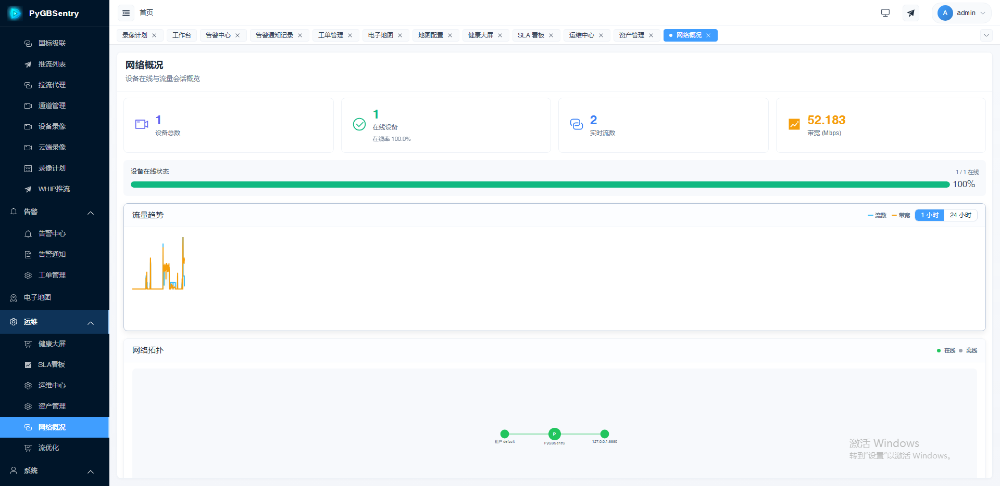
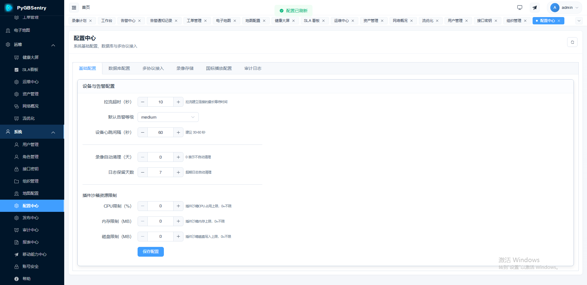

<p align="center">
  
</p>

<p align="center">
  <strong>PyGBSentry</strong>
</p>

<p align="center">
  <em>GB/T 28181 Video Platform · Pure Python SIP Stack, Built from Scratch</em>
</p>

<p align="center">
  <a href="README.md">🇨🇳 中文</a> ｜ <strong>🇬🇧 English</strong>
</p>

<p align="center">
  
  
  
  
  
  
</p>

---

> **🚀 Want a GB/T 28181 platform that starts in seconds, speaks Python natively, and plays nice with AI?**  
> You just found it.

PyGBSentry is a production-grade video surveillance platform built from the ground up with **Python + FastAPI**. No wrapping legacy C/C++ stacks — a **pure Python SIP signaling engine** that is fully transparent, debuggable, and extensible. From device registration to cascade federation, every byte is yours to inspect and customize.

---

## ✨ Why PyGBSentry?

| Dimension | PyGBSentry | Traditional Solutions |
|-----------|-----------|----------------------|
| ⚡ Startup Speed | **Seconds** | Minutes |
| 🛠️ Dev Efficiency | **Python Ecosystem** | Complex Configuration |
| 🤖 AI Integration | **Natively Friendly** | Extra Adaptation Needed |
| 🔄 Concurrency | **Async Architecture** | Thread Model |

Python + FastAPI means you get **second-level startup**, **native async concurrency**, and an **AI-friendly ecosystem** out of the box. No XML wrestling, no opaque binaries — just clean, readable Python.

---

## 🎯 Core Features

### ⚡ Sub-Second First Frame — <500ms

RTP port pool pre-allocation + 4-way parallel INVITE + RTT adaptive timers deliver the fastest live stream connection you've ever seen on a GB/T 28181 platform.

### 🩺 6-Dimension Health Scoring + Self-Healing Playback

Real-time health scoring across six dimensions with intelligent playback recovery:
- **RTCP NACK** — instant retransmission on packet loss
- **UDP → TCP Auto-Fallback** — seamless transport switch under network degradation
- **Dual-Buffer Seamless Switch** — zero-glitch stream transition

### 🔍 Pure Python SIP Stack — No Black Boxes

Every SIP message is parsed, constructed, and dispatched in pure Python. Fully transparent, fully debuggable, fully yours. Set a breakpoint anywhere in the signaling flow and see exactly what's happening.

### 📡 GB/T 28181-2022 Native Support

Full compliance with the latest standard:
- `a=track` SDP negotiation
- Absolute PTZ positioning
- 3D DragZoom control
- File catalog browsing

### 🧩 Plugin Ecosystem

Extend without forking:
- **Feishu** — alert notifications
- **WeCom** — enterprise messaging
- **MQTT** — IoT bridge
- **S3** — cloud archival
- **AI** — inference pipeline integration

### 🏎️ High Concurrency Optimizations

| Optimization | What It Does |
|-------------|-------------|
| Sharded DialogManager | 16× less lock contention across dialog shards |
| Object Pool | 2K+ pre-allocated objects, zero GC pressure on hot paths |
| Thread Pool | Parallel SIP message parsing across CPU cores |
| Pre-filter Handlers | 70% fewer invalid message scans before dispatch |

### 🏗️ Production HA

- **RFC 3261 State Machine** — standards-compliant SIP dialog lifecycle
- **Redis Persistence** — session state survives restarts
- **Node Failover** — automatic recovery in multi-node deployments
- **TLS Hot-Reload** — certificate rotation without downtime

---

## 📸 Screenshots

<table>
  <tr>
    <td align="center"><b>Dashboard</b></td>
    <td align="center"><b>Monitoring Center</b></td>
  </tr>
  <tr>
    <td></td>
    <td></td>
  </tr>
  <tr>
    <td align="center"><b>GIS Map</b></td>
    <td align="center"><b>Alarm Center</b></td>
  </tr>
  <tr>
    <td></td>
    <td></td>
  </tr>
  <tr>
    <td align="center"><b>Health Dashboard</b></td>
    <td align="center"><b>Ops Center</b></td>
  </tr>
  <tr>
    <td></td>
    <td></td>
  </tr>
  <tr>
    <td align="center"><b>Network Overview</b></td>
    <td align="center"><b>Channel Management</b></td>
  </tr>
  <tr>
    <td></td>
    <td></td>
  </tr>
  <tr>
    <td align="center"><b>Device List</b></td>
    <td align="center"><b>Config Center</b></td>
  </tr>
  <tr>
    <td></td>
    <td></td>
  </tr>
</table>

---

## 🏛️ Architecture

```
┌─────────────────────────────────────────────────────────────────────┐
│                        Client Layer                                  │
│   Web Console (Vue 3)  │  Mobile App (uni-app)  │  3rd-party/Devices│
└──────────────────────────┬──────────────────────────────────────────┘
                           │
┌──────────────────────────▼──────────────────────────────────────────┐
│                     Gateway (Nginx + HTTPS)                          │
└──────────────────────────┬──────────────────────────────────────────┘
                           │
┌──────────────────────────▼──────────────────────────────────────────┐
│                   Service Layer (FastAPI + asyncio)                   │
│   ┌──────────────────────┐  ┌──────────────────────────────────┐   │
│   │   REST API · WebSocket│  │       Plugin Runtime              │   │
│   │   Audit · Config Gov  │  │   Feishu/WeCom/MQTT/S3/AI        │   │
│   └──────────────────────┘  └──────────────────────────────────┘   │
│   ┌──────────────────────────────────────────────────────────────┐  │
│   │           Pure Python SIP Signaling Engine                     │  │
│   │   ┌──────────┐ ┌──────────┐ ┌──────────┐ ┌──────────────┐   │  │
│   │   │Sharded DM│ │Obj Pool  │ │Thread Pool│ │Pre-filter    │   │  │
│   │   │16x less  │ │2K pre-   │ │Parallel  │ │70% less      │   │  │
│   │   │contention│ │allocated │ │parsing   │ │invalid scans │   │  │
│   │   └──────────┘ └──────────┘ └──────────┘ └──────────────┘   │  │
│   │   GB28181 Register/Invite/Playback/Cascade/PTZ/Alarm/Talk     │  │
│   └──────────────────────────────────────────────────────────────┘  │
│   ┌──────────────────────────────────────────────────────────────┐  │
│   │           Streaming Gateway (ZLMediaKit)                       │  │
│   │   WebRTC / FLV / HLS / RTSP / RTMP · RTP Port Pre-allocation  │  │
│   └──────────────────────────────────────────────────────────────┘  │
├─────────────────────────────────────────────────────────────────────┤
│              Data Layer (PostgreSQL / MySQL / SQLite + Redis)        │
└─────────────────────────────────────────────────────────────────────┘
```

---

## 🚀 Installation & Deployment

> Not a developer? No problem. If you can copy and paste commands, you can get this running. Three methods below — **Docker is recommended**.

---

### Method 1: Docker Deployment (Recommended, Easiest)

> Best for: First-time deployment, production environments, users who don't want to manage dependencies

#### Step 1: Install Docker

**Linux (Ubuntu / Debian):**

```bash
# One-click Docker install (official script)
curl -fsSL https://get.docker.com | sudo sh

# Add current user to docker group (run without sudo)
sudo usermod -aG docker $USER

# Log out and back in for permissions to take effect, then verify
docker --version
# Example output: Docker version 24.x.x
```

**Windows / macOS:**

1. Download and install [Docker Desktop](https://www.docker.com/products/docker-desktop/)
2. After installation, launch Docker Desktop and wait for the status bar icon to show "Docker Desktop is running"
3. Open a terminal and verify: `docker --version`

#### Step 2: Clone the Repository

```bash
git clone https://github.com/suoten/PyGBSentry.git
cd PyGBSentry/editions/open-source
```

> No git? Install it first: `sudo apt install git -y` (Linux) or download from [git-scm.com](https://git-scm.com) (Windows)

#### Step 3: Create Configuration File

Create a `.env` file in the `editions/open-source` directory:

```bash
cat > .env << 'EOF'
# ===== Database password (use a strong password) =====
POSTGRES_PASSWORD=YourStrongDbPass!

# ===== Redis password (use a strong password) =====
REDIS_PASSWORD=YourStrongRedisPass!

# ===== Application secret key (use a random string, at least 32 chars) =====
SECRET_KEY=change-me-to-32-char-random-string

# ===== Media server secret (customize this) =====
MEDIA_SERVER_SECRET=zlm-secret-key

# ===== SIP device default password (customize this) =====
SIP_DEFAULT_PASSWORD=your-sip-password

# ===== Your server IP (IMPORTANT! Must change for Docker) =====
# Set to your server's actual LAN/public IP, NOT localhost
BACKEND_PUBLIC_HOST=192.168.1.100
EOF
```

> **Important**: `BACKEND_PUBLIC_HOST` must be set to your server's actual IP address, otherwise video streams won't play.
> Find your server IP: run `ip addr` on Linux or `ipconfig` on Windows.

#### Step 4: Start Services

```bash
docker compose up -d
```

The first start will pull images and build containers, which takes about 3-5 minutes depending on network speed.

#### Step 5: Verify Deployment

```bash
# Check that all containers are running (status should be healthy or running)
docker compose ps

# Check backend logs for errors
docker compose logs -f backend
# When you see "Application startup complete", startup is successful. Press Ctrl+C to exit logs.
```

#### Step 6: Access the System

Open your browser and navigate to `http://your-server-ip`

- Default admin username: `admin`
- Default password: `Aa332211`

> Please change the password immediately after first login!

If the page automatically redirects to the setup wizard (`/setup`), follow the wizard prompts to check database and media server connectivity.

---

### Method 2: aaPanel (BaoTa) Deployment

> Best for: Users managing servers with aaPanel

#### Step 1: Install Environment

In aaPanel "App Store", install:
- **Nginx** (required)
- **PostgreSQL** (recommended) or MySQL
- **Redis**
- **Python Manager** (for running the backend)

#### Step 2: Create Database

In aaPanel "Database" → "Add Database":
- Database name: `pygb28181`
- Username: `pygbsentry`
- Password: a strong custom password

#### Step 3: Deploy Backend

1. Upload the `backend` directory to `/www/wwwroot/pygbsentry_backend`
2. Copy the config file: `cp .env.example .env`
3. Edit `.env` and modify these key settings:

```env
DATABASE_TYPE=postgresql
DATABASE_HOST=127.0.0.1
DATABASE_PORT=5432
DATABASE_NAME=pygb28181
DATABASE_USER=pygbsentry
DATABASE_PASSWORD=the-password-you-set-in-step-2
REDIS_HOST=127.0.0.1
REDIS_PASSWORD=your-redis-password
SECRET_KEY=random-string-at-least-32-chars
MEDIA_SERVER_SECRET=custom-secret
SIP_DEFAULT_PASSWORD=custom-password
BACKEND_PUBLIC_HOST=your-server-ip
```

4. Add a project in "Python Manager":
   - Project path: `/www/wwwroot/pygbsentry_backend`
   - Startup file: `app/main.py`
   - Port: `8000`

#### Step 4: Deploy Frontend

```bash
cd /www/wwwroot/pygbsentry_frontend
npm install
npm run build
```

Set the generated `dist` directory as the Nginx site root.

#### Step 5: Configure Nginx Reverse Proxy

Add the following to the site configuration in aaPanel:

```nginx
location /api/ {
    proxy_pass http://127.0.0.1:8000/;
    proxy_set_header Host $host;
    proxy_set_header X-Real-IP $remote_addr;
    proxy_set_header X-Forwarded-For $proxy_add_x_forwarded_for;

    # WebSocket support (required, otherwise alarms and live logs won't work)
    proxy_http_version 1.1;
    proxy_set_header Upgrade $http_upgrade;
    proxy_set_header Connection "upgrade";
    proxy_read_timeout 3600;
}
```

---

### Method 3: Local Development

> Best for: Users who want to customize or debug the code

#### Linux / macOS

```bash
# 1. Make sure Python 3.10+ and PostgreSQL are installed
python3 --version    # Need 3.10+
psql --version       # Need a database

# 2. Enter the backend directory
cd backend

# 3. Create virtual environment and install dependencies
python3 -m venv .venv
source .venv/bin/activate
pip install -r requirements.txt

# 4. Configure environment variables
cp .env.example .env
# Edit .env to update database connection, SECRET_KEY, etc.

# 5. Start the backend
python -m app.main
```

#### Windows

```powershell
# 1. Make sure Python 3.10+ is installed (download from python.org, check "Add to PATH" during install)
python --version

# 2. Enter the backend directory
cd backend

# 3. Create virtual environment and install dependencies
python -m venv .venv
.\.venv\Scripts\Activate.ps1
# If you see an execution policy restriction, run first: Set-ExecutionPolicy -Scope Process -ExecutionPolicy Bypass
pip install -r requirements.txt

# 4. Configure environment variables
Copy-Item .env.example .env
# Edit .env with Notepad or VS Code to update database connection, SECRET_KEY, etc.

# 5. Start the backend
python -m app.main
```

---

### Firewall & Port Reference

After deployment, make sure the following ports are accessible:

| Port | Protocol | Purpose | Required? |
|:---|:---|:---|:---|
| 80 | TCP | Web frontend | Yes |
| 8000 | TCP | Backend API | Yes (without reverse proxy) |
| 5060 | UDP/TCP | SIP signaling | Yes |
| 30000-30999 | UDP | RTP video streams | **Must open, otherwise no video** |
| 8880 | TCP | ZLM HTTP (FLV/HLS playback) | Yes |
| 554 | TCP | RTSP playback | As needed |
| 1935 | TCP | RTMP playback | As needed |

> **Most common issue**: Page loads but no video → Check if firewall allows **UDP 30000-30999** port range.

---

### Post-Deployment Checklist

| Step | Verification |
|:---|:---|
| 1 | Browser can open the login page |
| 2 | `admin` account can log in |
| 3 | Added devices show online status |
| 4 | Live preview plays video correctly |
| 5 | Recording playback works correctly |

> Having issues? Check the [Detailed Deployment Guide](docs/INSTALL_DEPLOY.md) or [Troubleshooting](docs/QA_TROUBLESHOOT.md)

---

## 💻 System Requirements

| Scenario | OS | RAM | Notes |
|----------|----|-----|-------|
| Docker Full Deploy | Linux (Ubuntu 20.04+) | 4GB+ | Production recommended |
| Local Development | Linux / Windows / macOS | 2GB+ | Custom development |
| HA Cluster | Kubernetes 1.25+ | 8GB+ | Large-scale projects |

---

## 📚 Documentation

| Document | Description |
|----------|-------------|
| [Quick Start](docs/quickstart.md) | Get running in 5 minutes |
| [Deployment Guide](docs/deployment.md) | Production deployment walkthrough |
| [Configuration Reference](docs/configuration.md) | Every config key explained |
| [API Documentation](docs/api.md) | REST API & WebSocket reference |
| [Cascade Integration](docs/cascade.md) | Multi-platform federation |
| [FAQ](docs/faq.md) | Common questions answered |
| [Developer Guide](docs/DEVELOPER_EN.md) | Contribute & extend |
| [Plugin Specification](docs/PLUGIN_SPEC.md) | Build your own plugin |
| [Streaming Server Config](docs/MEDIA_SERVER.md) | ZLMediaKit tuning guide |

---

## 📜 License

PyGBSentry is released under the **AGPL v3.0** license. See [LICENSE](LICENSE) for details.

---

## 📬 Contact

- **QQ Group**: 928800460
- **GitHub**: [github.com/suoten/PyGBSentry](https://github.com/suoten/PyGBSentry)
- **Email**: [suoten@163.com](mailto:suoten@163.com)

---

<p align="center">
  <strong>If you find PyGBSentry useful, give us a ⭐ on GitHub — it keeps us building!</strong>
</p>
