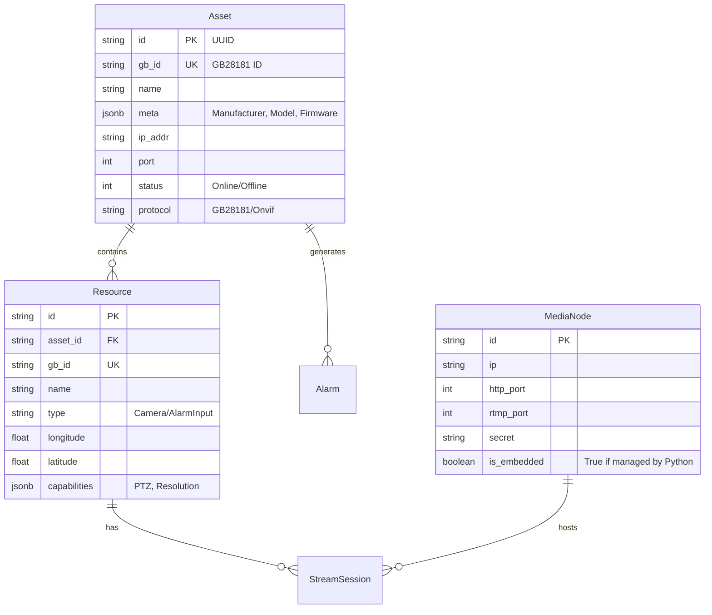

# Py-GB28181-Next Database Design

## 1. Design Principles
- **Autonomy**: Completely redesigned schema, distinct from legacy implementations.
- **Modernity**: Utilization of JSONB for flexible attributes and spatial types for GIS.
- **Performance**: Optimized indexing for high-concurrency SIP transaction lookups.

## 2. Entity Relationship Diagram (Conceptual)



## 3. Schema Definitions (SQLAlchemy)

### 3.1 Assets (Devices & Platforms)
```python
class Asset(Base):
    __tablename__ = "assets"
    
    id = Column(String(32), primary_key=True, default=generate_uuid)
    gb_id = Column(String(20), unique=True, nullable=False, index=True)
    name = Column(String(128))
    
    # Network
    transport = Column(String(10), default="UDP")  # UDP/TCP
    ip_addr = Column(String(64))
    port = Column(Integer)
    
    # Compatibility
    manufacturer = Column(String(64))  # Hikvision, Dahua, etc.
    model = Column(String(64))
    firmware = Column(String(64))
    
    # Status
    status = Column(Integer, default=0) # 0: Offline, 1: Online
    last_keepalive = Column(DateTime)
    register_time = Column(DateTime)
    
    # Auth
    password = Column(String(64))
    domain = Column(String(64))
    
    created_at = Column(DateTime, default=datetime.utcnow)
    updated_at = Column(DateTime, onupdate=datetime.utcnow)
```

### 3.2 Resources (Channels)
```python
class Resource(Base):
    __tablename__ = "resources"
    
    id = Column(String(32), primary_key=True, default=generate_uuid)
    asset_id = Column(String(32), ForeignKey("assets.id"), nullable=False)
    
    gb_id = Column(String(20), index=True)
    name = Column(String(255))
    
    # Type: 1=Camera, 2=Alarm, 3=Audio
    type = Column(Integer, default=1)
    
    # State
    status = Column(Integer, default=1) # 1: ON, 0: OFF
    
    # GIS (Using Float for compatibility, can upgrade to PostGIS Geometry)
    longitude = Column(Float)
    latitude = Column(Float)
    
    # Capabilities (PTZ support, resolution, etc.)
    capabilities = Column(JSONB, default={})
    
    parent_id = Column(String(32), ForeignKey("resources.id"), nullable=True)
```

### 3.3 MediaNodes (ZLMediaKit Servers)
```python
class MediaNode(Base):
    __tablename__ = "media_nodes"
    
    id = Column(String(32), primary_key=True)
    ip = Column(String(64))
    public_ip = Column(String(64)) # For NAT
    
    # Ports
    http_port = Column(Integer, default=80)
    rtsp_port = Column(Integer, default=554)
    rtmp_port = Column(Integer, default=1935)
    rtp_proxy_port = Column(Integer, default=10000)
    
    secret = Column(String(64))
    
    # Status
    is_online = Column(Boolean, default=False)
    load = Column(Float, default=0.0) # CPU/Bandwidth load
    
    # Management
    is_embedded = Column(Boolean, default=False) # True if managed by this system
```

### 3.4 StreamSessions (Active Streams)
```python
class StreamSession(Base):
    __tablename__ = "stream_sessions"
    
    id = Column(String(32), primary_key=True)
    app = Column(String(64))
    stream = Column(String(64))
    
    media_node_id = Column(String(32), ForeignKey("media_nodes.id"))
    resource_id = Column(String(32), ForeignKey("resources.id"))
    
    # SIP Dialog info
    call_id = Column(String(128))
    ssrc = Column(String(16))
    
    start_time = Column(DateTime, default=datetime.utcnow)
    protocol = Column(String(10)) # UDP/TCP-Active/TCP-Passive
```
