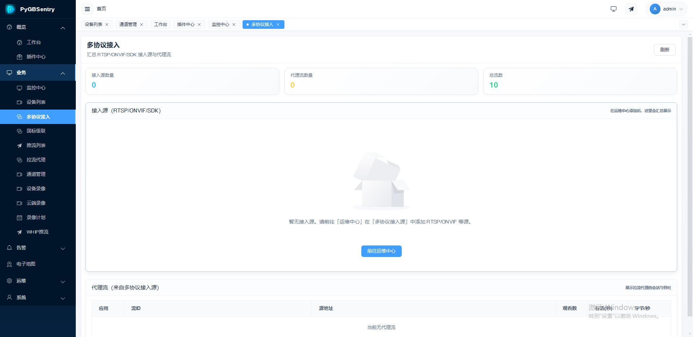
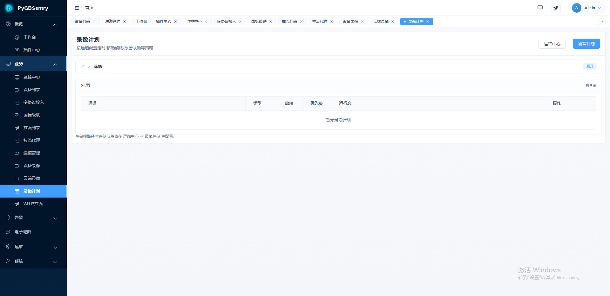

# PyGBSentry Product Capability Whitepaper

[中文版](PRODUCT_OSS.md)

> For product decision-makers, technical leads, and the open-source community — a comprehensive look at PyGBSentry's capabilities and technical excellence.

  
  
  

---

## One-Line Positioning

**PyGBSentry — A GB/T 28181-2022 video platform with a pure Python SIP stack built from the ground up. Every signaling line within reach.**

---

## Six Core Advantages

Every strength below is backed by verifiable source code. No marketing fluff, just engineering reality.

### 1. Sub-Second First Frame — Blazing Fast

| Capability | PyGBSentry Implementation | Value Delivered |
|:---|:---|:---|
| RTP Port | Pre-created 100-port pool at startup, zero wait on INVITE | **First frame drops from seconds to sub-second** |
| SIP Parsing | Native Python direct parse + thread pool parallel | **Shortest parse path, zero middleware overhead** |
| INVITE Flow | 4-way parallel execution (`asyncio.gather`) | **30-50ms additional latency reduction** |
| T1 Timer | RTT-adaptive (50ms LAN, 500ms WAN) | **10x faster on LAN** |
| First Frame | < 500ms | **Instant viewing, no waiting** |

**Source Reference**:
- RTP Port Pool: [`rtp_port_pool.py`](backend/app/sip/rtp_port_pool.py)
- 4-Way Parallel: [`invite.py#L2058-L2068`](backend/app/sip/invite.py#L2058-L2068)
- RTT-Adaptive: [`transactions.py#L25-L55`](backend/app/sip/transactions.py#L25-L55)

### 2. Quality + Bandwidth — H.265 + Smart Adaptive

| Capability | PyGBSentry Implementation | Value Delivered |
|:---|:---|:---|
| Codec | Full H.264 / H.265 / PS / MPEG4 support | **H.265 saves 50% bandwidth** |
| GB28181-2022 | Native 2022 with a=track for precise stream switching | **Latest standard, all features ready** |
| Adaptive Stream | Auto sub-stream on quality drop, restore on recovery | **Optimal bandwidth use, rock-solid quality** |
| SDP Negotiation | Capability cache, skip redundant negotiation | **Subsequent playback 50ms faster** |

**Source Reference**:
- H.265 fmtp: [`sdp.py#L265-L266`](backend/app/sip/sdp.py#L265-L266)
- Adaptive Stream: [`stream_strategy.py`](backend/app/services/stream_strategy.py)
- SDP Cache: [`stream_preloader.py#L62-L78`](backend/app/services/stream_preloader.py#L62-L78)

### 3. Self-Healing Playback — Four Lines of Defense

| Defense Line | PyGBSentry Implementation | Protection |
|:---|:---|:---|
| Quality Sensing | 6-dimension health scoring (FPS/Loss/Jitter/Latency/Buffer/Error) | **Catches issues at their onset** |
| Loss Recovery | RTCP NACK proactive retransmission + FIR keyframe | **Reliable video even over UDP** |
| Protocol Adapt | Auto TCP Passive after 2 UDP failures | **No interruption on network jitter** |
| Seamless Switch | Dual-buffer (build new, BYE old after first frame) | **Viewers notice nothing** |
| Anti-Oscillation | 10s cooldown period | **Zero ping-pong switching** |

**Source Reference**:
- 6-Dimension Scoring: [`stream_quality_monitor.py`](backend/app/services/stream_quality_monitor.py)
- RTCP Correction: [`qos_monitor.py#L531-L547`](backend/app/services/qos_monitor.py#L531-L547)
- Protocol Adapt: [`stream_strategy.py#L24-L46`](backend/app/services/stream_strategy.py#L24-L46)
- Dual-Buffer: [`invite.py#L923-L933`](backend/app/sip/invite.py#L923-L933)

### 4. High-Concurrency Python — Performance Unleashed

Four combined optimizations that push Python asyncio to its limits:

| Optimization | Mechanism | Effect |
|:---|:---|:---|
| **DialogManager Sharded Lock** | 16 independent shards, Call-ID hash routing | 16x less lock contention |
| **Handler Pre-Filter** | CSeq method index, exact match | 70-90% fewer wasted iterations |
| **SipMessage Object Pool** | 2000 pre-allocated messages, reuse pattern | 60-80% less GC frequency |
| **ThreadPoolExecutor Parallel Parse** | SIP parsing offloaded to thread pool, multi-core | Event loop never blocked |

**Overload Protection Layer**:

| Mechanism | Effect |
|:---|:---|
| Tiered Queue Drop | Prioritize ACK/BYE/CANCEL, reject INVITE with 503 |
| IP Sliding Window Rate Limit | 100 req/s/IP |
| Register Storm Protection | Global 50/s, 503 + Retry-After on overflow |
| INVITE Rate Limit | 8 per device / 5s + 40 per tenant / 5s |
| UDP 4MB Buffer | Zero packet loss under high concurrency |

**Source Reference**:
- Sharded Lock: [`dialog_manager.py#L44-L91`](backend/app/sip/dialog_manager.py#L44-L91)
- Object Pool: [`message.py#L390-L424`](backend/app/sip/message.py#L390-L424)
- Thread Pool: [`server.py#L110-L114`](backend/app/sip/server.py#L110-L114)
- Queue Drop: [`server.py#L456-L486`](backend/app/sip/server.py#L456-L486)

### 5. Intelligent Low Latency — Adapts to Your Network

| Capability | PyGBSentry Implementation | Value Delivered |
|:---|:---|:---|
| T1 Timer | 50ms LAN, 500ms WAN, RTT-dynamic | **10x faster on local networks** |
| RTP Port | Pre-allocated pool, zero wait | **Eliminates 50-500ms creation delay** |
| INVITE Execution | 4-way parallel | **30-50ms per request reduction** |
| 1xx Handling | Stop Timer A retransmission on 100 Trying | **Fewer wasted network round-trips** |

**Source Reference**:
- RTT Detection: [`transactions.py#L36-L43`](backend/app/sip/transactions.py#L36-L43)
- 1xx Handling: [`transactions.py#L519-L533`](backend/app/sip/transactions.py#L519-L533)

### 6. Production-Grade HA — Stability First

| Capability | PyGBSentry Implementation | Value Delivered |
|:---|:---|:---|
| Transaction FSM | Full RFC 3261 (Trying → Proceeding → Accepted → Confirmed → Terminated) | **Standards-compliant, predictable behavior** |
| Timer G/H/I/J | Full coverage (INVITE 2xx retransmit, ACK timeout, cleanup) | **Zero state leaks** |
| State Persistence | Redis sync transactions + dialogs, cluster restart recovery | **No session loss on restart** |
| Media Failover | Auto Re-INVITE to healthy ZLM node on failure | **Self-healing on node failure** |
| Node Retry | Up to 3 node retries + 10 port retries per node | **Exceptional fault tolerance** |
| SIP Firewall | sipvicious scan detection, BYE spoof prevention, Via loop detection | **Security built-in, no extra setup** |
| TLS Hot Reload | Build before teardown, no interruption | **Zero-downtime certificate updates** |
| Graceful Shutdown | Active BYE to all sessions | **No data or connection loss** |

**Source Reference**:
- FSM: [`transactions.py#L122-L351`](backend/app/sip/transactions.py#L122-L351)
- Timer G/H/I/J: [`transactions.py#L196-L305`](backend/app/sip/transactions.py#L196-L305)
- Redis Persistence: [`transactions.py#L140-L155`](backend/app/sip/transactions.py#L140-L155)
- Node Failover: [`invite.py#L1018-L1150`](backend/app/sip/invite.py#L1018-L1150)
- SIP Firewall: [`server.py#L650-L703`](backend/app/sip/server.py#L650-L703)
- TLS Hot Reload: [`server.py#L857-L900`](backend/app/sip/server.py#L857-L900)
- Graceful Shutdown: [`server.py#L1145-L1197`](backend/app/sip/server.py#L1145-L1197)

---

## Capability Overview

  
  
  

### GB28181 Access & Signaling

| Feature | Description |
|:---|:---|
| GB/T 28181-2022 Device/Platform Access | Backward compatible with 2016/2011, IPC/NVR/Cascade plug-and-play |
| UDP/TCP/TLS Triple Stack | Adapts to different network environments, SIPS encryption |
| Platform Cascade | Registration keepalive, catalog push, sharing, GPS subscription, status sync |
| Network Time Sync | Auto and manual modes |
| NAT Traversal | Complex network environments, multi-NIC |

### Video Services

| Feature | Description |
|:---|:---|
| Live Preview | 1/4/9/16/25/36 multi-split, plugin-free browser playback |
| Multi-Protocol Distribution | WebRTC / HTTP-FLV / HLS / RTSP / RTMP |
| Main/Sub-Stream Switch | On-demand switching, bandwidth saving, 2022 track support |
| PTZ Control | Direction, presets, patrol, 3D zoom positioning |
| Playback Search | Timeline precise search, multi-channel sync, seek |
| Voice Broadcast & Intercom | G.711A/U audio codec link |
| Remote Configuration | Batch deploy encoding/network/OSD parameters |

### GIS Visualization

| Feature | Description |
|:---|:---|
| Map Point Placement | Multiple map source support |
| Eagle Eye & Measurement | Spatial analysis |
| Layer Control | Vector tiles, custom layers |
| Visual Command | Track tracking, video linkage, alarm point flashing |
| Video Wall Splicing | Multi-screen splicing to wall |

### Alarms & Linkage

| Feature | Description |
|:---|:---|
| Alarm Reception & Real-Time Push | WebSocket real-time delivery, 20+ alarm subcategories |
| Alarm Linkage | Trigger recording, snapshots, notifications, video wall |
| Escalation & Confirmation | SLA-level management, confirmation, escalation, audit loop |

### Operations & Governance

| Feature | Description |
|:---|:---|
| Audit Center | All key operations logged and traceable |
| Config Center | Draft publish, rollback, version management |
| Health Diagnostics | Database/streaming/signaling comprehensive inspection |
| Monitoring Integration | Prometheus + Grafana + Loki full monitoring stack |

### Plugin Ecosystem

| Feature | Description |
|:---|:---|
| Built-in Plugin Manager | Install, uninstall, enable, disable, upgrade |
| Official Plugins | Feishu alerts, WeCom notifications, MQTT bridge, S3 storage |
| Extension Capabilities | AI recognition, mobile app, custom business logic |

---

## Scope

### Open-Source Edition Includes

- Full monitoring business chain (access, preview, playback, alarms, GIS, cascade, ops)
- Plugin runtime environment and plugin interfaces

### Not Included

- Commercial plugin marketplace review and listing process
- Payment and subscription billing
- License signing private key infrastructure

---

## Recommended Scenarios

| Scenario | Description |
|:---|:---|
| Government/Enterprise Intranet | Standard GB28181 access in secure isolated network, TLS encryption |
| Campus/Industry Private | Private deployment, no public network dependency |
| Smart City | Massive device access, multi-agency sharing |
| Legacy System Modernization | Low-cost RTSP/ONVIF device conversion to GB28181 |
| Visual Emergency Command | GIS map + alarm linkage + video wall, efficient dispatch |
| Development Base | Pure Python stack, zero barrier customization |

---

## Deployment Recommendations

| Scenario | Recommended Config |
|:---|:---|
| Trial/Demo | SQLite + local ZLM, 2 cores 4GB |
| Production | PostgreSQL + Redis + Nginx + ZLM, 4 cores 8GB+ |
| HA Cluster | Kubernetes + Helm, 8 cores 16GB+ |
| Cross-Network/Public | Follow [INSTALL_DEPLOY.md](INSTALL_DEPLOY.md) NAT section |

---

## Further Reading

| Doc | Description |
|:---|:---|
| [README.md](../README.md) | Overview & Quick Start |
| [INSTALL_DEPLOY.md](INSTALL_DEPLOY.md) | Detailed Deployment Guide |
| [DEVELOPER.md](DEVELOPER.md) | Architecture & Development |
| [MEDIA_SERVER.md](MEDIA_SERVER.md) | Streaming Server Configuration |
| [PLUGIN_SPEC.md](PLUGIN_SPEC.md) | Plugin Development Spec |