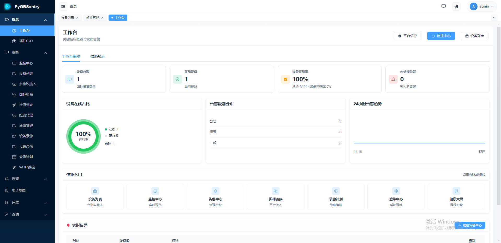
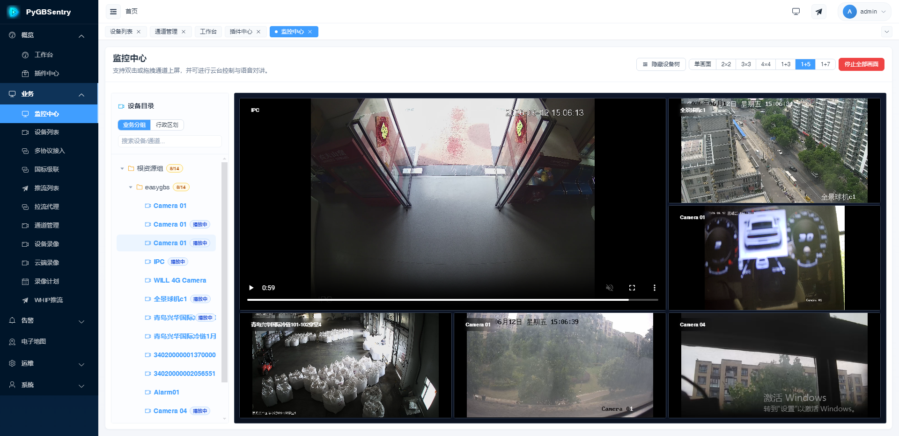
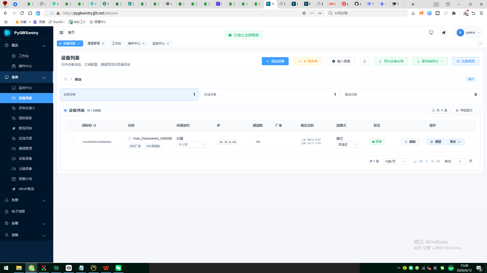
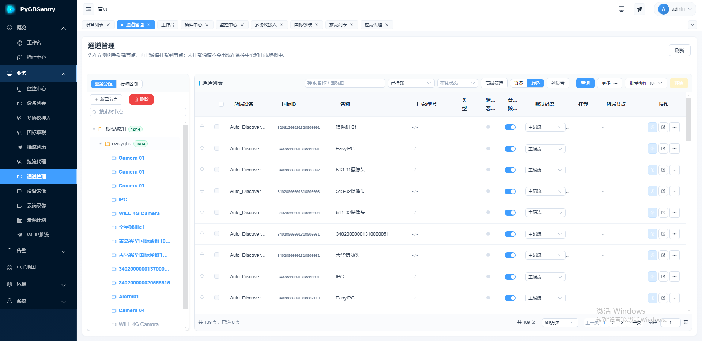
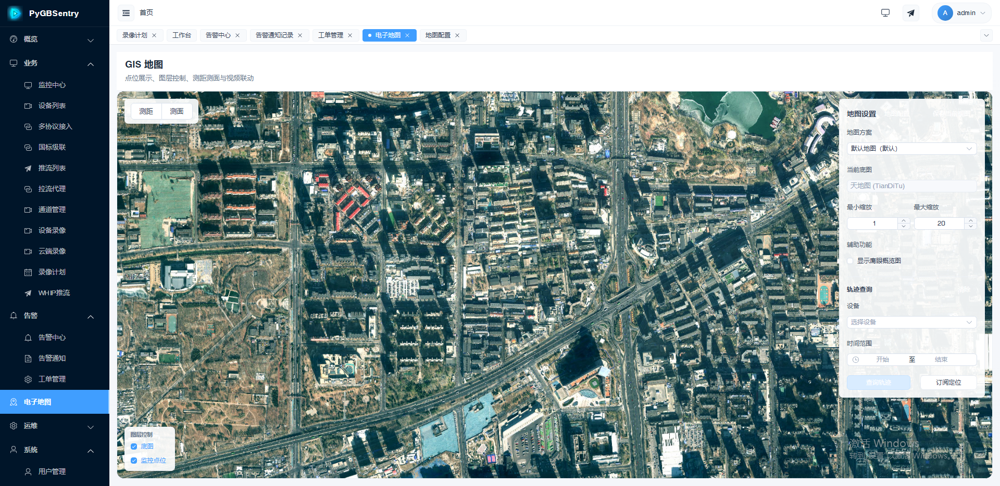
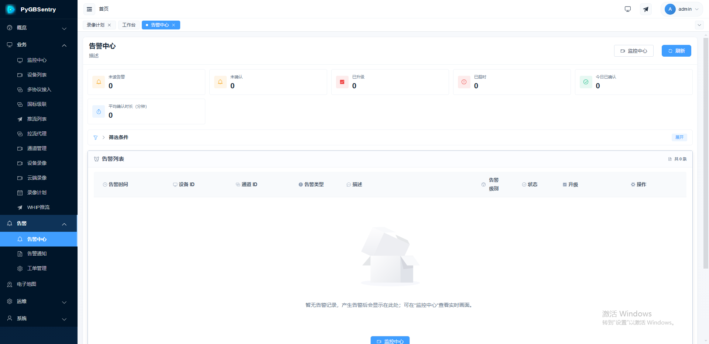
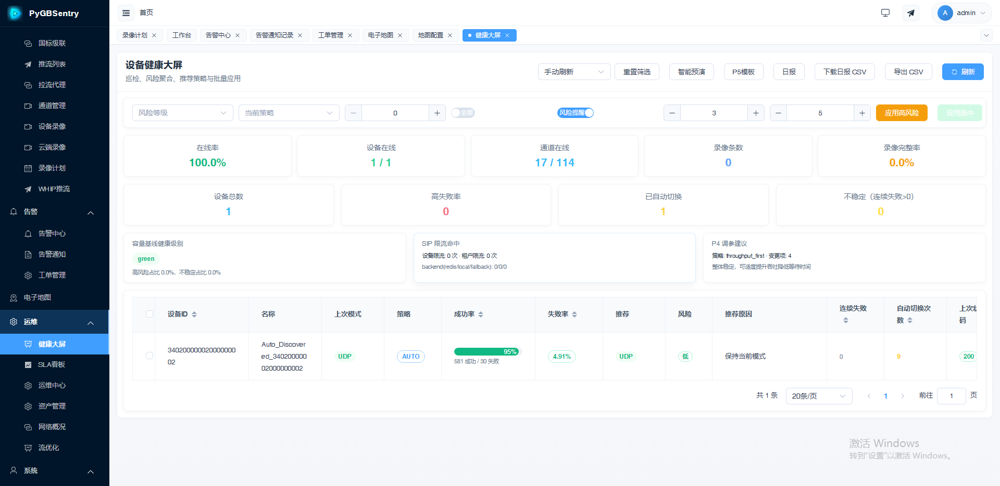
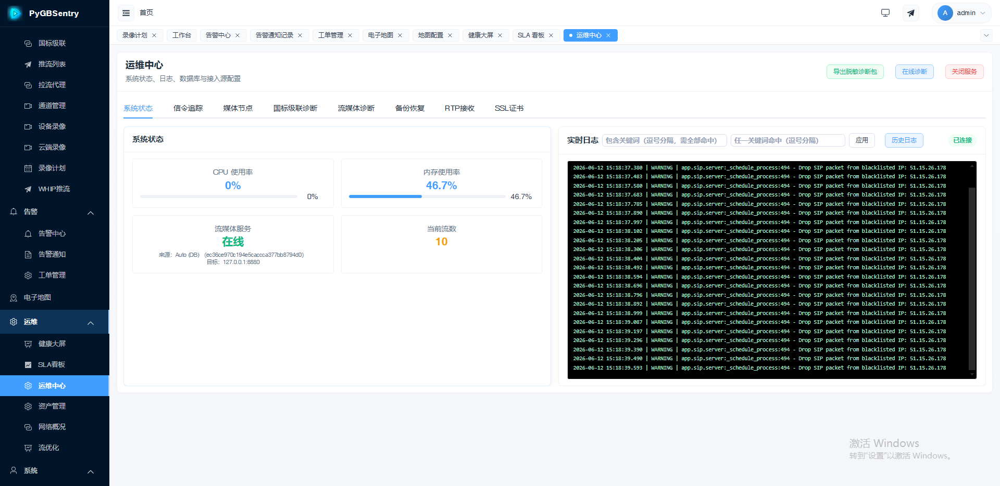

# PyGBSentry Documentation Hub

[中文版](README.md)

<p align="center">
  <strong>GB/T 28181-2022 Video Platform · Pure Python SIP Stack, Built from Scratch</strong>
</p>

<p align="center">
  
  
</p>

<p align="center"><em>Smart Dashboard · Multi-Split Monitoring Center</em></p>

---

> **One command to deploy. Sub-second video. All in Python.** From SIP stack to business logic — fully readable, debuggable, and customizable. This is your entry point to everything PyGBSentry.

---

## Document Navigation

### Quick Start

| Doc | For | Reading Time |
|:---|:---|:---|
| [../README.md](../README.md) | Everyone | 5 min — Overview & Highlights |
| [INSTALL.md](INSTALL.md) | Ops | 10 min — Quick Install |
| [INSTALL_DEPLOY.md](INSTALL_DEPLOY.md) | Ops | 30 min — Detailed Deployment |

### Product & Capabilities

| Doc | For | Description |
|:---|:---|:---|
| [PRODUCT_OSS.md](PRODUCT_OSS.md) | Decision Makers | **Product Capability Whitepaper + Technical Deep Dive** |
| [COMPATIBILITY.md](COMPATIBILITY.md) | Implementation | Device Compatibility Matrix |
| [MEDIA_SERVER.md](MEDIA_SERVER.md) | Ops & Devs | ZLMediaKit Configuration |

### Development & Extension

| Doc | For | Description |
|:---|:---|:---|
| [DEVELOPER.md](DEVELOPER.md) | Developers | **Architecture, SIP Stack Design, High-Concurrency Optimization** |
| [PLUGIN_SPEC.md](PLUGIN_SPEC.md) | Plugin Devs | Plugin Development Spec, Lifecycle, API |
| [PLUGIN_MOBILE_DESIGN.md](PLUGIN_MOBILE_DESIGN.md) | Mobile Devs | Mobile Plugin UI/UX Design Spec |
| [plugins/DEVELOPER_GUIDE.md](plugins/DEVELOPER_GUIDE.md) | Plugin Devs | Plugin Templates & Examples |
| [plugins/OFFICIAL_PLUGINS.md](plugins/OFFICIAL_PLUGINS.md) | Everyone | Official Plugin List |

### Operations & Troubleshooting

| Doc | For | Description |
|:---|:---|:---|
| [QA_TROUBLESHOOT.md](QA_TROUBLESHOOT.md) | Everyone | Common Issues |
| [QA_REGISTER_ERROR.md](QA_REGISTER_ERROR.md) | Ops | Registration Issues |
| [QA_PLAY_ERROR.md](QA_PLAY_ERROR.md) | Ops | Playback Issues |
| [SIP_UDP_LOAD_BALANCING.md](SIP_UDP_LOAD_BALANCING.md) | Ops | SIP UDP Load Balancing |

### Operation Guides

| Doc | For | Description |
|:---|:---|:---|
| [GUIDE_DEVICE_CONFIG.md](GUIDE_DEVICE_CONFIG.md) | Implementation | Device Access Guide |
| [GUIDE_OPERATION_FLOWS.md](GUIDE_OPERATION_FLOWS.md) | Users | System Operations |
| [GUIDE_PLUGIN_PURCHASE.md](GUIDE_PLUGIN_PURCHASE.md) | Users | Plugin Purchase Guide |

---

## Feature Quick View

<p align="center">
  
  
  
</p>

<p align="center">
  
  
  
</p>

<p align="center"><em>Device Management · Channel Management · GIS Map · Alarm Center · Health Dashboard · Ops Center</em></p>

---

## Recommended Reading Path

### First Contact (Product Selection)

```
../README.md  →  PRODUCT_OSS.md  →  COMPATIBILITY.md
  (5 min)         (10 min)          (3 min)
  Overview         Tech Deep Dive     Device Check
```

### First Deployment (Ops)

```
INSTALL_DEPLOY.md  →  MEDIA_SERVER.md  →  QA_TROUBLESHOOT.md
  (30 min)             (10 min)           (reference)
   Step-by-step          Streaming           Troubleshoot
```

### Development (Developers)

```
DEVELOPER.md  →  PLUGIN_SPEC.md  →  plugins/DEVELOPER_GUIDE.md
 (20 min)         (15 min)             (10 min)
  Architecture      Plugin Dev          Templates
```

---

## Tech Stack

| Component | Choice |
|:---|:---|
| Backend | Python 3.10+ / FastAPI / asyncio |
| Database | PostgreSQL / MySQL / SQLite |
| Cache | Redis |
| Streaming | ZLMediaKit |
| Frontend | Vue 3 / Element Plus / TypeScript |
| Mobile | uni-app (H5 / Mini / App) |
| Protocol | GB/T 28181-2022 SIP (Pure Python, Built from Scratch) |

---

## Links

- Repository: [github.com/suoten/PyGBSentry](https://github.com/suoten/PyGBSentry)
- Issues: [GitHub Issues](https://github.com/suoten/PyGBSentry/issues)
- Email: [suoten@163.com](mailto:suoten@163.com)
