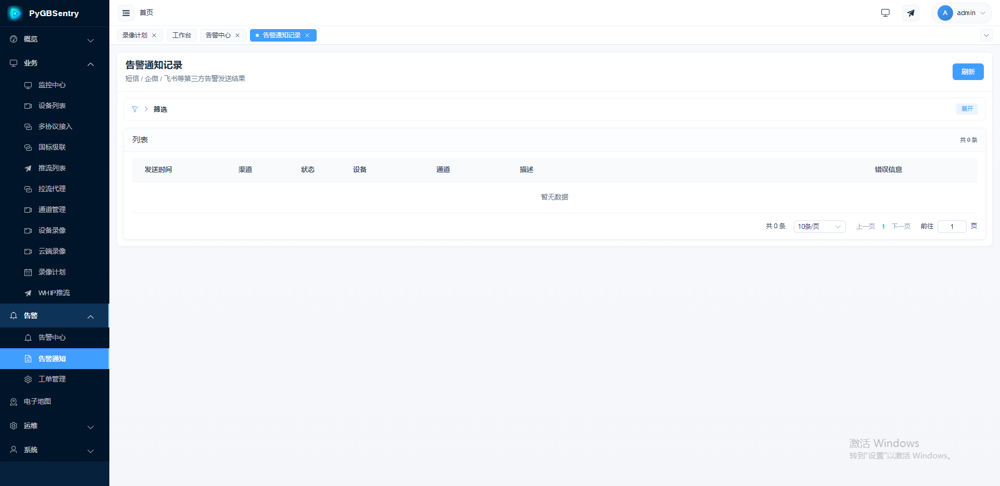

# 级联对接指南

> PyGBSentry 支持 GB/T 28181 平台级联——将上下级平台通过 SIP 信令互联，实现视频资源的跨平台共享与统一调度。

---

## 🌐 概述

**级联** 是 GB/T 28181 标准中定义的平台互联机制。通过级联，多个视频监控平台可以组成上下级关系，下级平台将自身的设备目录、视频流、报警信息等资源共享给上级平台，上级平台可像操作本地设备一样调阅下级的资源。

### 为什么使用级联？

| 场景 | 说明 |
|------|------|
| 🏢 多级视频共享 | 省→市→区多级平台互联，上级可查看下级所有视频资源 |
| 🌍 跨网络访问 | 不同网络区域的平台通过级联打通视频调阅通道 |
| 📊 分层管理 | 各级平台独立运维，上级仅做汇聚调度，互不干扰 |
| 🔗 资源整合 | 多套监控系统统一接入，消除信息孤岛 |

---

## 🏗️ 级联架构

```
┌──────────────────────────────────────────────────────────┐
│                      上级平台                             │
│              (省/市级视频监控平台)                          │
│                                                          │
│  ┌─────────┐   ┌─────────┐   ┌─────────┐               │
│  │ 目录管理 │   │ 视频调阅 │   │ 报警接收 │               │
│  └────┬────┘   └────┬────┘   └────┬────┘               │
│       │             │             │                      │
└───────┼─────────────┼─────────────┼──────────────────────┘
        │             │             │
        │    SIP 信令 (REGISTER / MESSAGE / INVITE)         │
        │             │             │
┌───────┼─────────────┼─────────────┼──────────────────────┐
│       │             │             │                      │
│  ┌────┴────┐   ┌────┴────┐   ┌────┴────┐               │
│  │ 目录推送 │   │ 流转发   │   │ 报警上报 │               │
│  └─────────┘   └─────────┘   └─────────┘               │
│                                                          │
│                   下级平台 (PyGBSentry)                    │
│                                                          │
│  ┌──────┐  ┌──────┐  ┌──────┐  ┌──────┐                │
│  │ IPC1 │  │ IPC2 │  │ NVR  │  │ ...  │                │
│  └──────┘  └──────┘  └──────┘  └──────┘                │
└──────────────────────────────────────────────────────────┘
```

**核心信令流程：**

- **REGISTER** — 下级平台向上级注册，建立级联关系
- **MESSAGE (Catalog)** — 下级推送设备目录给上级
- **INVITE** — 上级请求调阅下级的视频流
- **MESSAGE (Alarm)** — 下级转发报警通知给上级
- **MESSAGE (GPS)** — 下级转发设备位置给上级

---

## ⚙️ 配置步骤

### 第一步：获取本机 SIP 配置

在添加上级平台之前，需要先获取本平台（下级）的 SIP 信息，以便在上级平台侧完成对端配置。

**请求：**

```
GET /api/v1/platforms/server_config
```

**响应示例：**

```json
{
  "sip_id": "34020000002000000001",
  "sip_domain": "3402000000",
  "sip_ip": "192.168.1.100",
  "sip_port": 5060,
  "sip_transport": "UDP",
  "backend_public_host": "gbsentry.example.com",
  "backend_public_port": 8000
}
```

| 字段 | 说明 |
|------|------|
| `sip_id` | 本平台 SIP ID（20 位国标编码），需告知上级平台管理员 |
| `sip_domain` | SIP 域编码（10 位），与 `sip_id` 前 10 位一致 |
| `sip_ip` | SIP 服务监听地址 |
| `sip_port` | SIP 服务端口 |
| `sip_transport` | SIP 传输协议（UDP / TCP） |
| `backend_public_host` | 后端公网地址，级联流转发时上级需通过此地址回连 |

> 💡 **提示**：将上述信息提供给上级平台管理员，上级平台需据此将本平台配置为其下级。

---

### 第二步：添加上级平台

**请求：**

```
POST /api/v1/platforms/
```

**请求体：**

```json
{
  "name": "省级视频平台",
  "server_gb_id": "34000000002000000001",
  "server_ip": "10.0.0.1",
  "server_port": 5060,
  "transport": "UDP",
  "client_gb_id": "34020000002000000001",
  "password": "your_password",
  "register_interval": 3600,
  "keepalive_interval": 60,
  "enable": true
}
```

| 字段 | 必填 | 说明 |
|------|------|------|
| `name` | ✅ | 上级平台名称，便于识别 |
| `server_gb_id` | ✅ | 上级平台 SIP ID（20 位国标编码） |
| `server_ip` | ✅ | 上级平台 SIP 服务器地址 |
| `server_port` | — | 上级平台 SIP 端口，默认 `5060` |
| `transport` | — | 传输协议：`UDP` / `TCP`，默认 `UDP` |
| `client_gb_id` | ✅ | 本平台在上级侧的 SIP ID（通常与 `sip_id` 一致） |
| `password` | — | 注册密码，若为空则使用 `SIP_DEFAULT_PASSWORD` |
| `register_interval` | — | 注册间隔（秒），默认 `3600` |
| `keepalive_interval` | — | 心跳保活间隔（秒），默认 `60` |
| `enable` | — | 是否启用，默认 `true` |

**响应示例：**

```json
{
  "id": "a1b2c3d4e5f6",
  "name": "省级视频平台"
}
```

> ⚠️ **注意**：`server_gb_id` 在同一租户下必须唯一，重复添加会返回 `400` 错误。

---

### 第三步：平台自动注册与保活

添加上级平台并启用后，PyGBSentry 会自动执行以下流程：

```
下级平台 (PyGBSentry)                    上级平台
      │                                    │
      │  ① REGISTER (无认证)               │
      │ ─────────────────────────────────> │
      │                                    │
      │  ② 401 Unauthorized                │
      │    (WWW-Authenticate: nonce=xxx)    │
      │ <───────────────────────────────── │
      │                                    │
      │  ③ REGISTER (含 Digest 认证)       │
      │ ─────────────────────────────────> │
      │                                    │
      │  ④ 200 OK (注册成功)               │
      │ <───────────────────────────────── │
      │                                    │
      │  ⑤ 定期保活 (按 keepalive_interval)│
      │ ── ── ── ── ── ── ── ── ── ── ──>│
      │ <── ── ── ── ── ── ── ── ── ── ──│
      │                                    │
      │  ⑥ 定期刷新注册 (按 register_interval)
      │ ── ── ── ── ── ── ── ── ── ── ──>│
```

- **注册**：系统启动后自动向上级发起 REGISTER，遵循 Digest 认证流程
- **保活**：按 `keepalive_interval` 周期发送心跳，连续多次未收到响应则标记为离线
- **重连**：注册失败时自动指数退避重试，无需人工干预

也可手动触发注册：

```
POST /api/v1/platforms/{platform_id}/actions/register
```

---

## 📂 目录共享

### 目录推送机制

下级平台注册成功后，会将自身的设备/通道目录推送给上级平台，使上级能看到下级的所有可用通道。

```
下级平台 (PyGBSentry)                    上级平台
      │                                    │
      │  ① MESSAGE (Catalog Notify)        │
      │    通道列表: IPC-001, IPC-002...    │
      │ ─────────────────────────────────> │
      │                                    │
      │  ② 200 OK                         │
      │ <───────────────────────────────── │
      │                                    │
      │  ③ MESSAGE (Catalog Notify)        │
      │    增量更新: ADD/DEL/UPDATE         │
      │ ─────────────────────────────────> │
```

### 选择共享通道

默认情况下，所有通道都会推送给上级。可以通过 **目录资源配置** 精确控制哪些通道共享给上级。

**查看当前共享配置：**

```
GET /api/v1/platforms/{platform_id}/catalog-resources
```

**设置共享通道：**

```
PUT /api/v1/platforms/{platform_id}/catalog-resources
```

请求体：

```json
{
  "resource_ids": ["res-id-1", "res-id-2"],
  "mappings": [
    {
      "resource_id": "res-id-1",
      "virtual_gb_id": "34020000001320000001",
      "virtual_name": "大门摄像头",
      "virtual_parent_id": ""
    }
  ]
}
```

| 字段 | 说明 |
|------|------|
| `resource_ids` | 共享通道的资源 ID 列表；空列表表示推送全部通道 |
| `mappings` | 虚拟映射规则，可为通道指定在上级侧显示的编号和名称 |

> 💡 **虚拟映射**：通过 `virtual_gb_id` 和 `virtual_name` 可以为通道在上级侧指定不同的编号和名称，避免与上级本地通道编号冲突。

### 手动推送目录

修改共享配置后，可手动触发目录推送：

```
POST /api/v1/platforms/{platform_id}/actions/push-catalog
```

### 目录订阅与刷新

上级平台通常会通过 **目录订阅**（SUBSCRIBE Catalog）机制订阅下级的目录变化。当设备上线/离线/新增/删除时，下级会自动发送增量目录通知给上级，无需手动操作。

---

## 🎥 视频流级联

### 级联点播流程

上级平台调阅下级视频时，INVITE 请求会穿过级联链路到达下级设备：

```
上级平台              下级平台 (PyGBSentry)         下级设备 (IPC)
   │                        │                          │
   │  ① INVITE (SDP)       │                          │
   │ <─────────────────────│                          │
   │                        │  ② INVITE (SDP)         │
   │                        │ ────────────────────────>│
   │                        │                          │
   │                        │  ③ 200 OK (SDP)          │
   │                        │ <────────────────────────│
   │                        │                          │
   │  ④ 200 OK (SDP)       │                          │
   │ ──────────────────────>│                          │
   │                        │                          │
   │  ⑤ ACK                │  ⑥ ACK                  │
   │ ──────────────────────>│ ────────────────────────>│
   │                        │                          │
   │                        │  ⑦ RTP 流               │
   │                        │ <════════════════════════│
   │                        │                          │
   │  ⑧ RTP 流转发         │                          │
   │ <═════════════════════│                          │
```

### RTP 流转发

级联点播时，视频流路径为：**设备 → ZLMediaKit（下级） → 上级平台**

关键配置项：

| 配置 | 说明 |
|------|------|
| `MEDIA_SERVER_RTP_PROXY_PORT_RANGE` | RTP 端口范围，需确保防火墙放行 |
| `BACKEND_PUBLIC_HOST` | 后端公网地址，上级需通过此地址回连获取流 |
| `MEDIA_SERVER_RTP_STREAM_MODE` | 流传输模式，`UDP` 或 `TCP_PASSIVE` |

> ⚠️ **NAT 环境**：如果下级平台在 NAT 后面，`BACKEND_PUBLIC_HOST` 必须设置为公网可达地址，否则上级无法拉取视频流。

---

## 🚨 报警转发

下级平台可将设备报警事件转发给上级平台：

```
设备                   下级平台 (PyGBSentry)           上级平台
 │                         │                            │
 │  ① 报警触发             │                            │
 │  ② MESSAGE (报警通知)   │                            │
 │ ──────────────────────>│                            │
 │                         │                            │
 │                         │  ③ MESSAGE (报警转发)      │
 │                         │ ──────────────────────────>│
 │                         │                            │
 │                         │  ④ 200 OK                  │
 │                         │ <──────────────────────────│
```

### 报警订阅

上级平台通过 **报警订阅**（SUBSCRIBE Alarm）机制订阅下级的报警事件。订阅成功后，下级设备产生的报警会自动转发给上级。

订阅状态可在级联管理界面查看——订阅信息列中的图标从左到右依次为：**报警订阅**、**目录订阅**、**移动位置订阅**。

---

## 📍 GPS / 位置订阅

支持将下级设备的 GPS 定位信息上报给上级平台：

```
设备 (移动设备)         下级平台 (PyGBSentry)           上级平台
 │                         │                            │
 │  ① GPS 位置上报         │                            │
 │  ② MESSAGE (位置通知)   │                            │
 │ ──────────────────────>│                            │
 │                         │                            │
 │                         │  ③ MESSAGE (位置转发)      │
 │                         │ ──────────────────────────>│
 │                         │                            │
 │                         │  ④ 200 OK                  │
 │                         │ <──────────────────────────│
```

上级平台通过 **移动位置订阅**（SUBSCRIBE MobilePosition）订阅下级的设备位置。订阅成功后，移动设备的位置变化会自动上报给上级。

---

## 🔧 配置参考

### SIP 服务配置（`backend/.env`）

| 变量名 | 说明 | 默认值 | 级联注意事项 |
|--------|------|--------|-------------|
| `SIP_ID` | 本平台 SIP ID（20 位编码） | `34020000002000000001` | **级联网络中必须唯一**，按国标编码规则填写 |
| `SIP_DOMAIN` | SIP 域编码（10 位） | `3402000000` | 与 `SIP_ID` 前 10 位一致 |
| `SIP_IP` | SIP 监听地址 | `0.0.0.0` | Docker 环境按需调整 |
| `SIP_PORT` | SIP 端口 | `5060` | 确保防火墙放行 |
| `SIP_DEFAULT_PASSWORD` | SIP 设备注册密码 | — | **生产必填**，级联注册使用此密码 |

### 上级平台传输协议

| 协议 | 适用场景 | 说明 |
|------|----------|------|
| `UDP` | 局域网 / 稳定网络 | 默认方式，延迟低，但 UDP 无状态需注意保活 |
| `TCP` | 跨网 / NAT 环境 | 可靠传输，适合网络不稳定场景 |

### Docker / NAT 环境关键配置

| 变量名 | 说明 | 级联影响 |
|--------|------|----------|
| `BACKEND_PUBLIC_HOST` | 后端公网地址 | **级联流转发必须**，上级通过此地址回连 |
| `BACKEND_PUBLIC_PORT` | 后端公网端口 | 默认 `8000`，按实际映射填写 |
| `RTP_PORT_RANGE_START` | RTP 端口映射起始 | 需与 ZLM 端口范围对应 |
| `RTP_PORT_RANGE_END` | RTP 端口映射结束 | 需与 ZLM 端口范围对应 |
| `RUNNING_IN_DOCKER` | Docker 环境标识 | Docker 部署时设为 `true` |

---

## 🖥️ 级联管理界面



在级联管理界面中可以：

- 📋 查看所有上级平台列表及在线状态
- ➕ 添加 / 编辑 / 删除上级平台
- 🔄 手动触发注册或目录推送
- 📡 查看订阅状态（报警 / 目录 / 位置）
- 🔍 诊断平台连接问题

---

## 🔍 故障排查

### 平台注册不上

| 检查项 | 操作 |
|--------|------|
| SIP ID 是否正确 | 确认 `server_gb_id` 为上级平台的 20 位国标编码 |
| IP / 端口是否可达 | 使用 `ping` 和端口探测工具确认上级 SIP 地址可访问 |
| 传输协议是否匹配 | 确认本端 `transport` 与上级平台配置一致（UDP / TCP） |
| 密码是否正确 | 确认 `password` 与上级平台为下级分配的注册密码一致 |
| 上级是否已添加本平台 | 联系上级管理员确认已将本平台配置为其下级 |
| 平台是否启用 | 检查 `enable` 字段是否为 `true` |

> 💡 可使用诊断接口查看详细错误信息：`GET /api/v1/platforms/{platform_id}/diagnosis`

### 目录不同步

| 检查项 | 操作 |
|--------|------|
| 目录推送配置 | 确认 `catalog-resources` 配置了正确的通道列表（空列表=全部推送） |
| 通道是否在线 | 确认要共享的通道设备处于在线状态 |
| 手动推送 | 调用 `POST /api/v1/platforms/{platform_id}/actions/push-catalog` 手动触发 |
| 目录订阅状态 | 查看上级是否已发起目录订阅（SUBSCRIBE Catalog） |
| 批量推送设置 | 如果通道很多，调整 `catalog_batch_size` 分批推送 |

### 级联点播失败

| 检查项 | 操作 |
|--------|------|
| RTP 端口范围 | 确认 `MEDIA_SERVER_RTP_PROXY_PORT_RANGE` 端口段在防火墙中放行 |
| NAT 配置 | 确认 `BACKEND_PUBLIC_HOST` 设置为公网可达地址 |
| 流传输模式 | 网络不稳定时尝试将 `MEDIA_SERVER_RTP_STREAM_MODE` 改为 `TCP_PASSIVE` |
| SSRC 冲突 | 检查上级和下级的 SSRC 分配范围是否重叠 |
| ZLM 节点状态 | 确认 ZLMediaKit 服务正常运行 |

### 报警未转发

| 检查项 | 操作 |
|--------|------|
| 报警订阅状态 | 确认上级已发起报警订阅（SUBSCRIBE Alarm） |
| 设备是否上报报警 | 确认下级设备确实产生了报警事件 |
| 平台在线状态 | 确认级联平台处于在线状态 |
| 报警通知渠道 | 检查级联引擎事件队列是否正常消费 |

---

> 📖 **相关文档**：
> - [配置参考](./configuration.md) — 完整环境变量说明
> - [协议原理与操作图解](./GUIDE_OPERATION_FLOWS.md) — 级联信令时序详解
> - [常见问题排查](./QA_TROUBLESHOOT.md) — 通用故障排查手册
> - [流媒体配置](./MEDIA_SERVER.md) — ZLMediaKit 配置指南
